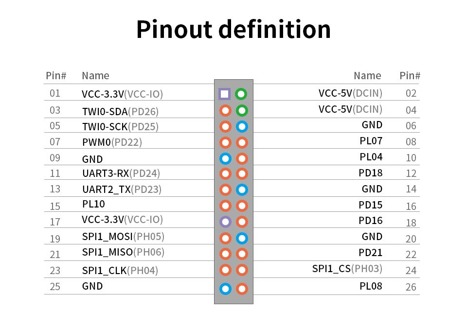
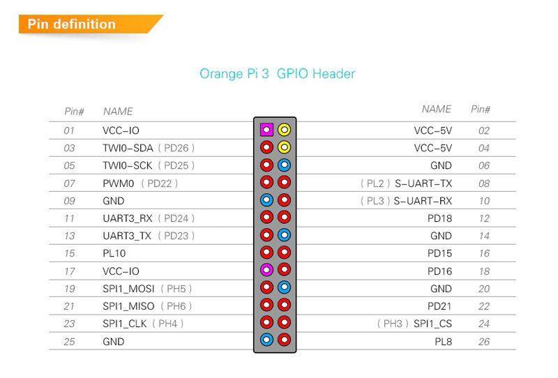

A comparison of [CherryPi PC H6](http://www.chinalctech.com/cpzx/CherryPi_series/2020/1210/497.html) stock Android 3.10.65 DTS against OrangePi 3 5.4.65 Armbian

## Problem

Fix the stock Android DTS to compile with the new kernel:

```
./dtc -I dts -O dtb -f sun50iw6-cherrypi.dts -o sun50iw6-cherrypi.dtb
```

Currenly, there are lots of warnings, e.g.:

```
sun50iw6-cherrypi.dts:2515.11-2532.5: Warning (unique_unit_address): /soc@03000000/usbc0@0: duplicate unit-address (also used in node /soc@03000000/usbc1@0)
sun50iw6-cherrypi.dts:2515.11-2532.5: Warning (unique_unit_address): /soc@03000000/usbc0@0: duplicate unit-address (also used in node /soc@03000000/usbc2@0)
sun50iw6-cherrypi.dts:2560.11-2567.5: Warning (unique_unit_address): /soc@03000000/usbc1@0: duplicate unit-address (also used in node /soc@03000000/usbc2@0)
```

## Recovery

We modify the original boot.cmd, in order to introduce the recovery option. With the following U-boot command, an old working version of device tree is used instead of the broken one:

```
setenv recovery=recovery.dtb
```

## CherryPi H6 GPIO Pinout



## OrangePi 3 (Allwinner H6)



## Current state

In `dts` folder we made the following changes to the reference Orange Pi device tree:

* Enabling UART interface on GPIO pins (apparently, the only one UART interface that could work on GPIO pins; there is also `r_uart` interface, but we could not get it to work)
* Disabling interfaces we are not using in our CherryPi application, such as HDMI and bluetooth

## Further reading

[Device Tree Customization](https://developer.toradex.com/device-tree-customization)
